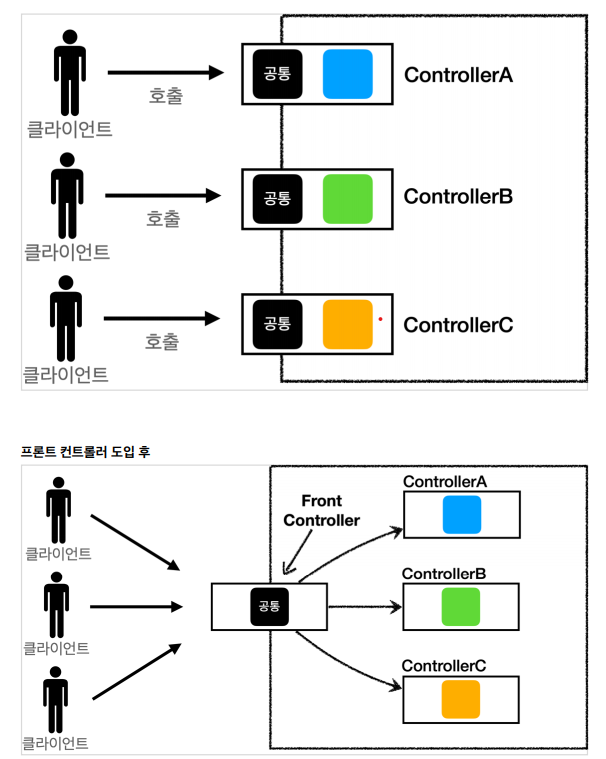

##### 스프링 MVC 학습
- 기간: 2021-06-03 ~ 06-17
- 학습내용
    - *서블릿(HTTP 요청 데이터 다루기)*
    - *JSP사용 및 MVC패턴 적용*
      - JSP의 경우는 view와 로직적인 부분들이 모두 합쳐져 있기에 관리가 어렵고 HTML과 java코드가 혼합되고
      데이터 조회하는 repository까지 모두 노출된다.
        -> MVC 패턴의 적용이 필요하다.
    - *MVC 프레임워크 생성해보기 (Spring 사용X)*
      - Front Controller
        - 서블릿 하나로 클라이언트 요청을 받는다.
        - Client로부터 유입된 요청을 각 컨트롤러가 직접 받는게 아닌 앞단에 Front Controller를 위치시켜서 공통처리를 하고 각 컨트롤러를 호출 할 수 있도록 한다.
        - 프론트 컨트롤러는 요청에 맞는 컨트롤러를 찾아준다.
          
        - **Spring MVC의 DispacherServlet도 FrontController 패턴으로 구현되어 있다.** 
      - View 분리
      - Model 추가
      - 어댑터 패턴
    - *스프링 MVC 구조 이해*
        - 핸들러 매핑, 핸들러 어댑터
        - 뷰 리졸버
        - @Controller, @RestController, @RequestMapping, @GetMapping, @PostMapping 
        - @RequestParam, @RequestHeader
        - @ModelAttribute, @ResponseBody
        - 메세지 컨버터의 이해
        - Argument Resolver의 이해
            - 커스텀해서 추가해보기
        - ReturnValueHandler
            - 컨틀롤러의 반환값을 변환하고 처리해준다.
            - 컨트롤러에서 String 타입으로 view의 이름을 return해도 동작하는 이유이다.
            - 10여개의 ReturnValueHandler를 지원한다.
            - ex) ModelAndView, @ResponseBody, HttpEntity, String...
        - 타임리프 사용하기