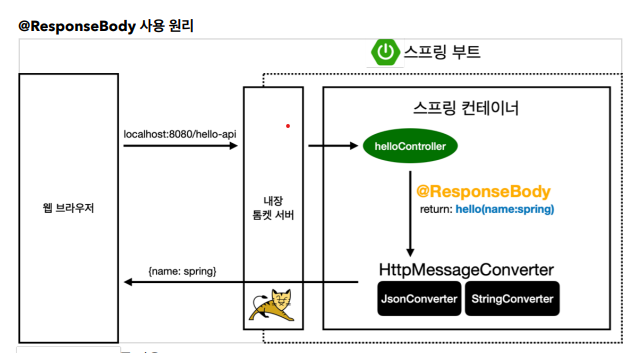
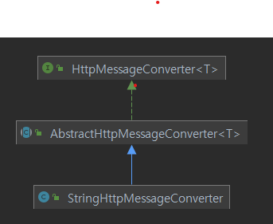
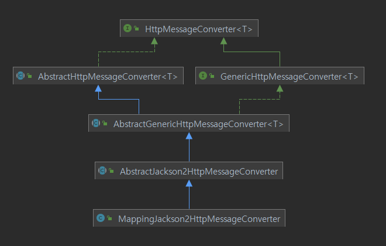

### HTTP Message Converter

@ResponseBody를 사용하면
- HTTP body에 문자내용을 바로 응답 할 수 있다.
- viewResolver 대신에 HttpMessageConverter를 통해서 메세지를 바로 응답한다.
- 기본문자 처리는 StringHttpMessageConverter가 처리
- 기본객체 처리는 MappingJackson2HttpMessageConverter가 처리
  (객체는 json 형태로 변환된다.)
- byte처리 등등 기타 여러 HttpMessageConverter가 기본으로 등록되어 있음

@RequestBody
- 요청된 body데이터를 메세지 컨버터를 통해서 객체로 매핑한다.
  (JSON -> 메세지 컨버터 -> 객체)
  
@ResponseBody
- 응답 할 내용을 메세지 컨버터를 통해서 String 혹은 JSON형태로 변환한다.
  
---
---
*모든 메세지 컨버터는 HttpMessageConverter 인터페이스를 구현한 구현체이다.*
- canRead, canWrite: 메세지 컨버터가 해당 클래스, 미디어타입을 지원하는지 체크
- read, write: 실제 메세지 컨버터를 통해서 메세지를 읽어들이거나 쓰는 기능


  
위의 StringHttpMessageConverter와 MappingJackson2HttpMessageConverter는 모두 HttpMessageConverter를 구현하고 있다.

---
###### 스프링부트에서의 기본 메세지 컨버터
    우선순위      메세지 컨버터
       1         ByteArrayHttpMessageConverter
       2         StringHttpMessageConverter
       3         MappingJackson2HttpMessageConverter
이외에도 더 존재함


---
####### ByteArrayHttpMessageConverter
path: org/springframework/http/converter/ByteArrayHttpMessageConverter.java
- 클래스타입: byte[], 미디어타입: '*/*'
- 요청시, byte[] 형태 데이터로 변수에 할당
- 응답시, byte[] 그대로 반환, 미디어타입은 application/octet-stream

####### StringHttpMessageConverter
path: org/springframework/http/converter/StringHttpMessageConverter.java
- 클래스타입: String, 미디어타입: '*/*'
- 요청: @RequestBody String data
- 응답: @ResponseBody return "ok", 쓰기 미디어타입: text/plain

####### MappingJackson2HttpMessageConverter
parh: org/springframework/http/converter/json/MappingJackson2HttpMessageConverter.java
- 클래스타입: 객체 또는 HashMap일 때 처리가능, 미디어타입은 application/json 관련
- 요청: @RequestBody HelloData data
- 응답: @ResponseBody return data, 쓰기 미디어타입은 application/json


---
---

### **요청된 Content-type과 @RequestBody의 class 타입을 보고 각 메세지 컨버터를 순차적으로 순회하면서 사용 할 메세지 컨버터를 결정한다.**
```
요청된 Content-type: application/json

@RequestMapping(...)
public void hello(@RequestBody String data) {...}

>> @RequestBody class 타입이 String이고 응답을 application/json으로 해줘야하니 StringHttpMessageConverter에 해당

```

````
요청된 Content-type: application/json

@RequestMapping(...)
public void hello(@RequestBody HelloData data) {...}

>> @RequestBody의 class타입이 객체이므로 Byte, String 메세지 컨버터에는 해당되지 않고 MappingJackson2HttpMessageConverter로 결정됨
```
