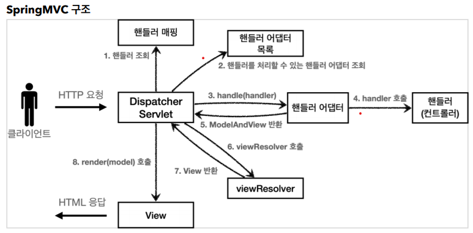
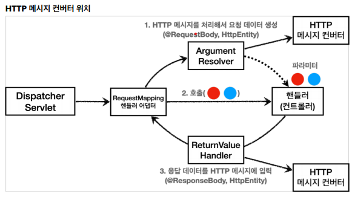

###### HttpMessageConverter는 누가 어디에서 호출되는걸까?

일단 앞서서 예제를 실행해본 경험상 @RequestMapping을 사용한 컨트롤러에는 정말 다양한
파라미터를 전달 할 수 있었다.
(@RequestMapping은 RequestMappingHandlerAdapter가 처리)
예를 들어서 HttpServeletRequest부터 InputStream, HttpEntity<>, Model등을
전달 할 수 있었다.

참고: org/springframework/web/servlet/mvc/method/annotation/RequestMappingHandlerAdapter.java

###### ■그러면 이러한 다양한 파라미터를 전달하도록 지원하는건 누가? (약 30여개의 파라미터를 지원한다.)
> 바로 Argument Resolver이다.

Argument Resolver가 상세하게 코드상 어디에서 호출되는지는 모르겠지만, 원하는 Mapping을 찾은 후 인터셉터가 동작 한 뒤에 호출된다고 한다.  
[동작원리 참고문서](https://velog.io/@kingcjy/Spring-HandlerMethodArgumentResolver%EC%9D%98-%EC%82%AC%EC%9A%A9%EB%B2%95%EA%B3%BC-%EB%8F%99%EC%9E%91%EC%9B%90%EB%A6%AC)  

> **동작순서**  
> - 사용자가 웹 브라우저를 통해서 요청을 전달하면 `Dispatcher Servlet`이 요청을 받는다.
> - Dispatcher Servlet은 요청 URL에 해당되는 HandlerMapping 처리
>   - RequestMapping에 대한 매칭
>   - 인터셉터 처리
>   - `Argument Resolver 처리`
>   - Message Converter 처리
> - Controller Method Invoke  

###### 그러면 언제 이 Argument Resolver를 커스텀하고 활용 할 수 있을까?
- API통신을 위해서 컨트롤러로 유입되는 파라미터를 원하는대로 가공하거나 설정 할 때 사용 가능
- Controller로 유입되는 다양한 종류의 데이터를 전처리해야하는 경우 점점 Utils가 많아지고 복잡해질 때
