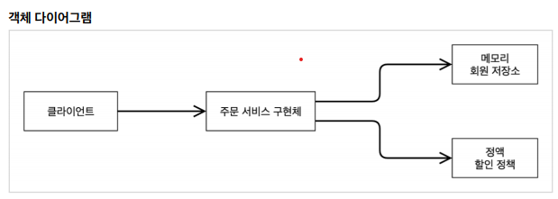

##### 제어의 역전(IoC, Inversion Of Control)
- 프로그램에 대한 제어 권한이 구현체 내부에서 제어하는게 아니라 외부에 의해서 관리되는 것
- `MemberServiceImpl`은 내부에 있는 `MemberRepository`가 어떤 동작을 하는지 모른다.  
단순히 회원정보를 저장하는 `역활`에 집중한다.
- 이러한 `MemberRepository`가 어떤 구현체로 동작 할지는 `AppConfig`에 의해서 결정된다.  
즉, AppConfig가 프로그램의 제어 흐름을 관리하는 것이다.
  
---

##### 의존관계 주입(DI, Dependency Injection)
- `정적인 클래스 의존관계`
  - 어플리케이션을 실행하지 않아도 분석이 가능하다. 예를 들어서 `OrderServiceImpl`은 
    `MemberRepository`, `DiscountPolicy`인터페이스에 의존하는 것을 실행없이 알 수 있다.
  - 하지만 어떤 구현체(객체)가 `OrderSeviceImpl`에 주입되는 알 수 없다.
  
- `실행시점에 결정되는 동적인 객체 의존관계`
  - 어플리케이션 실행시점에 외부(AppConfig)에서 객체를 생성하고 전달하여 의존관계가 결정된다.
  - 객체 인스턴스를 생성하고, 참조값 전달을 통해서 연결된다.
  - 의존관계 주입을 사용하면 클라이언트(Service쪽) 코드를 변경하지않고, 클라이언트가 호출하는 인터페이스의 타입 인스턴스를 변경 할 수 있다.
  - 의존관계 주입을 사용하면 정적인 클래스 의존관계를 수정하지 않고도 동적인 객체의 의존관계를 수정 할 수 있다.  
    => **코드를 수정하지 않고 구현객체 대상 변경**
  

#

---

##### IoC 컨테이너, DI 컨테이너
- `AppConfig`처럼 객체를 생성하고 의존관계를 주입해주는 것을 `IoC컨테이너`, `DI컨테이너`라고 한다.
- 요즘은 보통 `DI컨테이너`라고 한다.

---

##### @Configuration, @Bean
- 스프링은 `@Configuration`이 붙은 클래스를 구성정보로 사용하고 `@Bean`이 있는 객체를 모두 `스프링 빈`으로 등록한다.
- @Bean이 붙은 메소드명을 빈의 이름으로 사용한다.
```

    @Bean
    public MemberService memberService() {
        return new MemberServiceImpl(memberRepository());
    }
    
    MemberService memberService = applicationContext.getBean("memberService", MemberService.class);
```