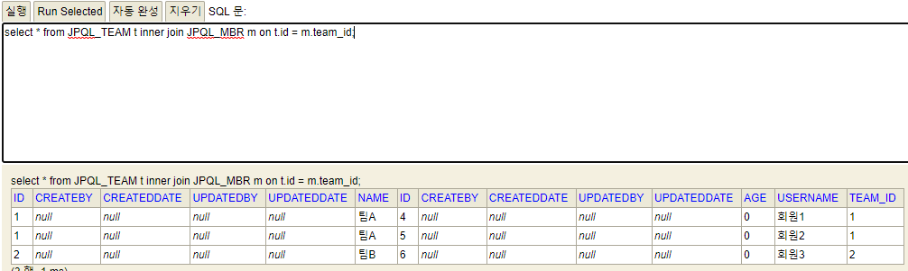
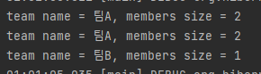

### JPQL
- JPA를 사용하면 엔티티 객체를 중심으로 개발하게 된다.
- 검색 시, 테이블이 아닌 엔티티 객체를 대상으로 검색한다.
- 모든 DB의 데이터를 객체로 변환하여 검색하는 것은 불가능하니, 결국 조건문이 포함된 SQL을 구성 할 수 있어야 한다.
    - JPA는 SQL을 추상화한 JPQL이라는 `객체 지향 쿼리 언어`를 제공한다.
- SQL문법과 유사하다.
  
- JPQL은 엔티티 객체를 대상으로 쿼리를 실행하는 것이다.
- SQL은 DB 테이블을 대상으로 쿼리를 실행하는 것이다.
```java
List<Member> findMemberList = em.createQuery(
        "select m from Member m where m.name like '%회원%'",
        Member.class
).getResultList();
```

### Criteria (표준스펙에 있지만 잘 사용하지 않음, 유지보수 힘듬)
- JPQL을 사용한 모습을 보면 결국 쿼리는 String이다. 동적 쿼리를 생성하기가 참 까다로울 수 있다.
- 자바코드를 사용해서 JPQL을 생성 할 수 있도록 해준다.
    - 장점
        - 쿼리를 자바코드로 구성하므로 컴파일시 에러 감지 가능
        - 동적 쿼리를 생성하기 비교적 편함
    - 단점
        - 그냥 쿼리보다는 알아보기 힘듬(SQL스럽지 않다)

### QueryDSL (사용 권장)
- 문자가 아닌 자바코드로 JPQL을 작성 할 수 있다.
- JPQL 빌더 역할
- 컴파일 시점에 문법 오류를 찾을 수 있고, 동적쿼리 작성이 용이하다.
- 실무에서 사용을 권장한다.


### 네이티브 SQL
- JPA가 제공하는 SQL을 직접 작성하여 실행
- JPA를 통해서 해결 할 수 없는 데이터베이스에 의존적인 기능


### JPQL 기본 문법
- 엔티티와 속성은 대소문자를 구분한다. (Member, age..)
- JPQL 키워드는 대소문자 구분 X (ex. select)

#### typeQuery
- 반환타입이 명확할 때 사용한다.

---

### 프로젝션
- SELECT 절에 조회 할 대상을 지정하는 것.

#### 종류
- 엔티티 프로젝션: select m from Member m
- 엔티티 프로젝션: select m.team from Member m
  - 암묵적으로 join 쿼리가 발생한다. 왠만하면 JPQL에도 join 쿼리를 명시해서 혼동을 방지하는게 좋다.
- 임베디드 프로젝션: select m.address FROM Member m
- 스칼라 타입 프로젝션: select m.username, m.age FROM Member m

---

### 페이징
- JPA는 페이징을 두 개의 API로 추상화 해놓았다.
1. setFirstResult()
2. setMaxResults()


### 경로 표현식
- .(점)을 찍어서 객체 그래프를 탐색하는 것
```sql
select m.username -> 상태 필드
 from Member m 
 join m.team t -> 단일 값 연관 필드
 join m.orders o -> 컬렉션 값 연관 필드
where t.name = '팀A'
```
- 상태필드: 단순히 값을 저장하기 위한 필드
- 연관필드: 연관관계를 위한 필드
 - 단일 값 연관 필드: @ManyToOne, @OneToOne, 대상이 엔티티인 경우
 - 컬렉션 값 연관 필드: @OneToMany, @ManyToMany, 대상이 컬렉션인 경우

### 경로 표현식의 특징
- 상태필드: 경로 탐색의 끝, 탐색X
- 단일 값 연관 필드: 묵시적인 join 쿼리가 발생한다. 탐색 불가
- 컬렉션 값 연관 필드: 묵시적인 join 쿼리가 발생한다. 탐색이 가능.

```
묵시적인 join(inner join만 가능)은 쿼리 튜닝 및 유지보수에 있어서 혼란을 불러일으킨다.
명시적으로 join을 사용하는 것이 좋다.
```

JPQL: select m.username, m.age from Member m
SQL: select username, age from Member

JPQL: select o.member from Orders o
SQL: select m.* from Orders o inner join Member m on o.member_id = m.id (묵시적인 join 발생)

### 경로탐색 주의사항
- 묵시적인 join은 항상 inner 조인이다. (그 외에는 명시적으로 사용해야함.)
- 컬렉션은 경로탐색의 끝이다. 그 이상의 경로탐색을 하고 싶으면 명시적인 join과 함께 별칭을 부여해야한다.
ex) select t.members(컬렉션) from Team t -> t.members.username (불가)
  select m.username from Team t inner join t.members m (가능)
```sql 
select m.username from Team t inner join t.members m 어떻게 SQL 쿼리로 변환될까?

// JPA가 만든 쿼리
select
    members1_.USERNAME as col_0_0_ 
from
    JPQL_TEAM team0_ 
inner join
    JPQL_MBR members1_ 
        on team0_.id=members1_.TEAM_ID
        
// 실제 쿼리
select m.username from Team t inner join Member m on t.id = m.team_id
```

### Fetch join
- SQL join의 종류가 아니다.
- JSQL에서 성능 최적화를 위해서 제공하는 기능
- 연관된 엔티티나 컬렉션을 한번에 조회 할 수 있는 기능
- 즉시로딩이다. (지연로딩 따윈 없다.)
- 상황에 따라서 지연로딩을 할 것인지 페치조인으로 할 것인지 결정해야한다. (어떤게 더 이득일지 고민해야함)


### 엔티티 페치 조인
- 회원을 조회하면서 연관된 팀의 정보도 함께 조회한다. (SQL이 한번만 발생한다.)
- select m from Member m join fetch m.team

### 컬렉션 페치 조인
- 일다대 관계에서의 페치조인이다.
- Team의 입장에서 Member에 대한 조인을 하는 경우 팀1개에는 여러N명의 회원이 있을 수 있기 때문이다.
    - 여기서 주의해야 할 점이 있다.
    Team의 입장에서는 Member에 대한 조인을 걸면 회원이 N명이 있을 수 있기에 동일한 조인의 결과가 N개로 표현된다.  

[SQL을 직접 실행한 경우]
- 조인의 결과가 `팀A`에 회원2명, `팀B`에 회원1명 이기에 총 3개의 row가 표시된다.
  

[JPQL 실행]
- JPA의 입장에서는 위의 DB의 join의 결과인 3개의 row를 그대로 받아오기 때문에 중복에 대한 자체적인 처리 방법이 없다. 
```java
String collectionFetchJoin = "select t from Team t join fetch t.members m";
List<Team> resultTeams = em.createQuery(collectionFetchJoin, Team.class).getResultList();
for (Team t : resultTeams) {
    System.out.println("team name = " + t.getName()+", members size = "+t.getMembers().size());
}
```



방안: [중복된 결과를 제거하기 위해서 DISTINCT를 사용한다.]
1. SQL에 DISTINCT를 추가한다.
    - SQL에 distinct를 추가하지만 데이터가 다르기에 중복을 제거 할 수 없다.
    - `String collectionFetchJoin = "select distinct t from Team t join fetch t.members m";`
2. 애플리케이션에서 엔티티 중복을 제거한다.
    - JPA가 distinct를 보고 중복을 애플리케이션 내에서 제거처리한다. (JPA가 걸러준 것임)
    

### 일반조인과 페치조인의 차이는?
- `일반조인은 연관된 엔티티를 함게 조회하지 않는다.` -> 가장 중요
- 일반조인은 JPQL의 결과를 반환 할 때, 연관관계를 고려하지 않는다.
    - 단지, select절에 있는 엔티티만 조회 할 뿐이다.
- 페치조인을 사용 할 때만 연관된 엔티티도 함께 조회한다. (즉시로딩)
- 페치조인은 객체 그래프를 SQL 한번에 모두 조회하는 개념
- 대다수의 N+1 이슈가 해결된다. (안되는 경우도 있나보다,,)


### 페치조인의 한계
- 페이조인 대상에는 별칭을 줄 수 없다.
- 둘 이상의 컬렉션은 페치 조인을 할 수 없다.
- 컬렉션을 페치 조인하면 페이지API를 사용 할 수 없다.
    - 일대다에서 사용 불가. (데이터가 뻥튀기 되고 1개의 데이터만 가져왔다고 했을 때, 중복을 제거 할 수 없음)
    - `22:52:11.685 [main] WARN org.hibernate.hql.internal.ast.QueryTranslatorImpl - HHH000104: firstResult/maxResults specified with collection fetch; applying in memory!`
    - 메모리에서 페이징을 해준다. SQL에 페이징 관련 쿼리가 없다 (중요!!)
        - DB에 있는 데이터를 모두 메모리에 올리고 페이징한다. `진짜 망한다. (만약 1만건이면..?) O_O`

일대다 페치조인에서 페이징API를 사용해야한다면?    
- 대안1: 일대다 관계에서 페이징이 필요하다면 그 관계를 뒤집에서 JPQL을 구성해보자.
    - `select t from Team t join fetch t.members m` -> `select m from Member m join fetch m.team t`
    
- 대안2: 조인을 사용하지 않는다. 그리고 @BatchSize를 통해서 Lazy 로딩되는 쿼리들을 묶어서 처리 할 수 있도록한다.
    - @BatchSize는 글로벌한 옵션으로도 지정이 가능하다. 묶여서 전달된 Lazy 로딩 쿼리를 `IN 쿼리`로 동작하도록 한다.
    - 페치 조인처럼 1번의 쿼리로 정리 할수는 없지만 기존의 `N+1 이슈`를 `1+1으로 최적화` 할 수 있다.  
      (물론 BatchSize에 따라서 쿼리는 더 나갈 수 있다.)
    - ex) @BatchSize(size = 100) 보통 1000이하의 값을 준다.
    
```
모든 것을 페치조인으로 해결 할 수는 없다. 하지만 대부분의 성능문제는 페치조인으로 해결이 가능하다. (70~80%)
페치조인은 객체 그래프를 유지 할 때 사용하면 효과적이다.
```