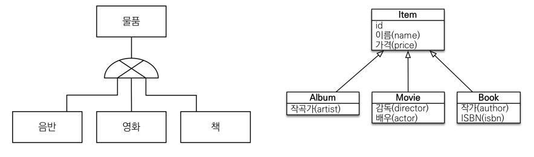
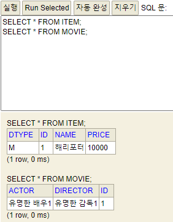
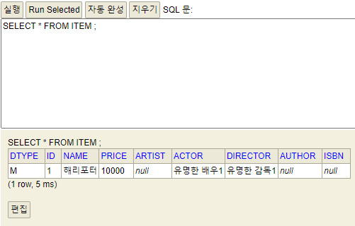
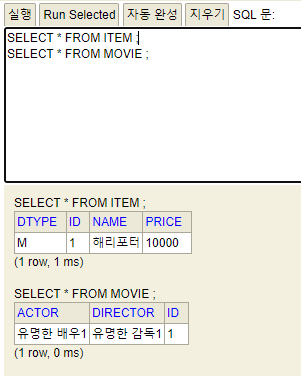
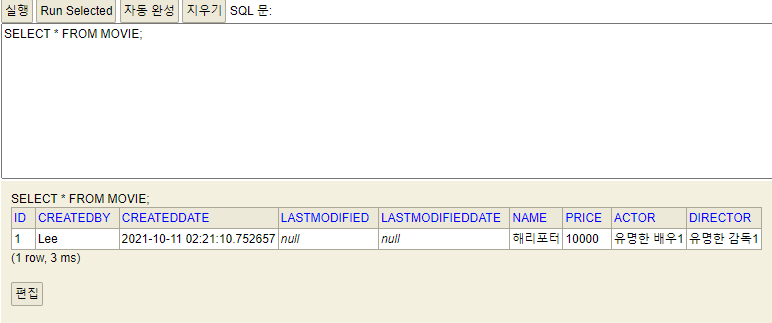

## 상속관계 매핑
- 관계형 DB에는 상속 관계가 없다.
- 슈퍼타입/서브타입이라는 모델링 기법이 객체 상속과 유사하다. -> 이를 구현하는 것.

  
---
## 슈퍼타입/서브타입 논리모델을 실제 물리 모델로 구현하는 방법
###각각의 테이블로 변환 -> `조인전략`(정석)
````
장점
- 가장 `정규화`된 방식
- 외래 키 참조 무결성 제약조건 활용가능
- 저장공간 효율화

단점
- 조회시 조인을 많이 사용 -> 성능 저하
- 조회 쿼리가 복잡하다.
- 데이터 저장 시, 각 테이블에 insert를 해야하니 총 2번의 SQL이 호출된다.

사용법
- @Inheritance(strategy = InheritanceType.JOINED)
````

```sql
Movie 조회 시, -> 조인컬럼이 생성된다.
select
    movie0_.id as id2_2_0_,
    movie0_1_.name as name3_2_0_,
    movie0_1_.price as price4_2_0_,
    movie0_.actor as actor1_3_0_,
    movie0_.director as director2_3_0_ 
from
    Movie movie0_ 
inner join
    ITEM movie0_1_ 
        on movie0_.id=movie0_1_.id 
where
    movie0_.id=?
```
---
### 통합 테이블로 변환 -> `단일테이블 전략`
````
장점
- 조인쿼리가 없다.
- 테이블이 단순하다.

단점
- 관계 없는 컬럼은 모두 null이 허용된다. (데이터 무결성이 깨진다.)
- 테이블이 커지고 컬럼이 많으면 조회 성능이 떨어질 수 있다. (임계점에 다다르면)

- DTYPE으로 구분(이 값으로 Movie인지, Album인지 구분 할 수 있음)
- @Inheritance(strategy = InheritanceType.SINGLE_TABLE)
- insert 쿼리가 가장 적게 호출된다.
- 조회시에도 조인없이 가장 심플하게 쿼리가 생성된다.
````

```sql
단일테이블 전략 -> 조회 시, 쿼리
select
    movie0_.id as id2_0_0_,
    movie0_.name as name3_0_0_,
    movie0_.price as price4_0_0_,
    movie0_.actor as actor6_0_0_,
    movie0_.director as director7_0_0_ 
from
    ITEM movie0_ 
where
    movie0_.id=? 
    and movie0_.DTYPE='M'
```
---
### 서브타입 테이블로 변환 -> `구현 클래스마다 테이블 전략`(사용하면 안된다.)
````
장점
- 서브타입을 명확하게 구분하여 처리 할 때 효과적
- not null 제약조건 사용가능

단점
- 부모타입으로 조회시, 모든 하위 테이블(Movie, Album, Book)을 모두 다 살펴보아야 한다.

- @Inheritance(strategy = InheritanceType.TABLE_PER_CLASS)
- Item 테이블이 생성되지 않는다.
````


결론: `JPA 상속관계 매핑은 DB의 슈퍼타입/서브타입의 논리모델을 어떠한 물리모델로 구현하던지간에 모두 매핑이 가능하도록 지원해준다.`

---
**주요 어노테이션**
`@Inheritance(strategy=InheritanceType.XXX)`
- JOINED: 조인전략
- SINGLE_TABLE: 단일 테이블 전략 -> 기본전략 방식
- TABLE_PER_CLASS: 구현 클래스마다 테이블 전략

`@DiscriminatorColumn(name=“DTYPE”)`
- Dtype이라는 컬럼이 DB에 생긴다.
- 디폴트는 DTYPE이다.

`@DiscriminatorValue(“XXX”)`
- 자식타입의 이름을 변경 할 수 있다.

  
---
### Mapped SuperClass - 매핑정보상속
- 공통 매핑 정보가 필요할 때 사용
- 반복적으로 각 엔티티에 중복되는 속성을 상속하여 사용
- 상속관계와 관련이 없다.
- 직접 생성해서 사용 할 일이 없으므로 추상클래스로 권장
```sql
공통적인 속성값들이 컬럼에 추가되었다.
create table Movie (
   id bigint not null,
    createdBy varchar(255),
    createdDate timestamp,
    lastModified varchar(255),
    lastModifiedDate timestamp,
    name varchar(255),
    price integer not null,
    actor varchar(255),
    director varchar(255),
    primary key (id)
)
```
