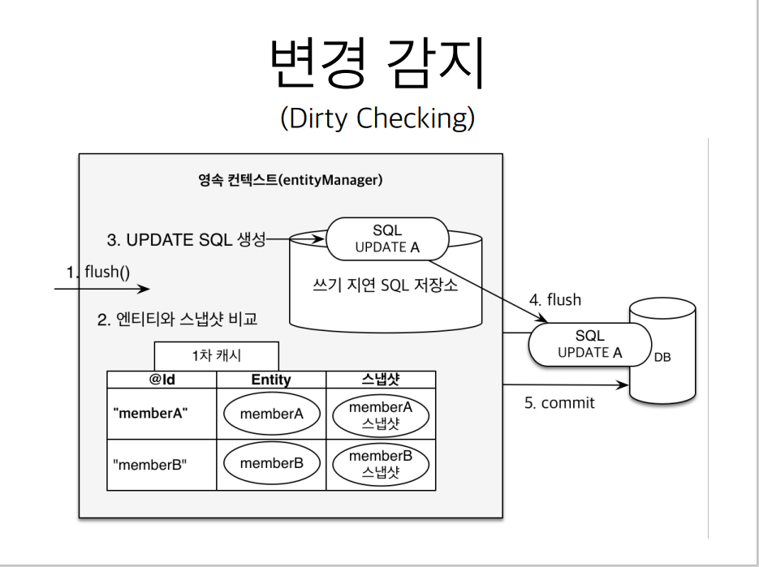

````
JPA에서 중요한 2가지
````

[EntityManager Factory]
- 엔티티매니저를 생성하는 역활을 담당한다.
- 고객의 요청(ex. 회원가입/수정/삭제 등 DB와 관련된 작업)이 있는 경우 엔티티 매니저를 생성한다.
- 그 후, 엔티티 매니저는 Conenction Pool을 통해서 DB connection을 획득하고 실제 DB쿼리 실행을 수행한다.

[영속성 컨테스트 (논리적인 개념)]
- 엔티티를 영구적으로 저장하는 환경
- 엔티티 매니저를 통해서 영속성 컨텍스트에 접근한다. 
- em.persist(entity); -> 엔티티를 DB에 저장한다는 의미가 아니다.  
  엔티티를 영속성 컨테스트에 저장한다는 뜻이다.
  
[엔티티의 생명주기]
- 비영속 (new/transient)
  - 겍체가 생성된 상태. 아직 컨텍스트에 저장되지 않음.
  - JPA와 아무런 관계가 없다.  
- 영속 (managed)
  - 컨텍스트에 객체를 저장한 상태. (persist한 것)
    ```java
        Member member = new Member(); -> 비영속 상태
        member.setId(1L);
        member.setName("test");
        
        em.persist(member); -> 영속성 컨테스트에 저장함. 영속상태 진입
        -> 아직 DB에 저장된게 아니다.
        
        tx.commit(); -> 트랜잭션이 commit되면 이때서야 쿼리가 실행된다.         
    ```
- 준영속 (detached)
- 삭제 (removed)

---
**특징**

[엔티티 조회, 1차 캐시]
- 객체가 영속화 될 때, 1차 캐시에 엔티티를 저장한다. 바로 find()하면 DB에 쿼리를 보내지 않는다.
- 엔티티매니저가 find()하면 DB를 바로 확인하는게 아닌 1차캐시를 확인한다.
- 다만, 엔티티 컨텍스트는 하나의 트랜잭션내에서만 유지되기에 여러 접속이 있는 상황에서는 큰 이점은 없을 수 있다.

[연속 엔티티의 동일성 보장]
- 1차 캐시로 반복 가능한 읽기 등급의 트랜잭션 격리 수준을 데이터베이스가 아닌 어플리케이션 차원에서 제공

[트랜잭션을 지원하는 쓰기 지연]
```java
tx.begin();

em.persist(member1); --> 1차캐시 및 SQL 저장소에 저장
em.persist(member2); --> 1차캐시 및 SQL 저장소에 저장
// 여기까지 영속화 컨테스트에 엔티티가 저장된다.

// 트랜잭션이 commit되는 순간 Insert SQL을 보낸다.        
tx.commit();
```
- 영속성 컨텍스트 내부에 `쓰기지연 SQL저장소`에 SQL이 저장된다.
- 일정부분 SQL 쿼리를 모아서 한번에 DB에 전달 할 수 있다. -> hibernate 옵션으로 그 크기를 지정 할 수 있다. 

[변경감지, Dirty Checking]
```java
Member member = em.find(Member.class, 1L);
member.setName("이름변경");

// em.update();가 없어도 엔티티의 내용이 변경되면서 update 쿼리가 전달된다.
tx.commit(); -> 이 시점에 쿼리가 전달됨

```
- commit()이 발생하면 flush가 발생함
- 영속성 컨테스트 내부의 엔티티와 스냅샷을 비교한다.
- 엔티티의 상태가 변경되었다? -> update SQL을 작성하여 SQL 저장소에 쿼리 저장.
 - flush가 다시 발생하면 -> SQL이 전달된다.

---

**플러시(Flush)**
- 영속성 컨테스트의 변경사항을 DB에 반영하는 것.

방법
- em.flush();
- 트랜잭션 커밋이 발생하는 경우(자동)
- JPQL 쿼리가 실행되는 경우(자동)
```java
em.persist(member1);
em.persist(member2);
em.persist(member3);
// 아직 commit되지 않았으니, 쿼리가 전달되지 않았다.

// JPQL을 통해서 select을 한다. -> 데이터가 아직 DB에 저장되지 않았을 텐데..?
// 그래서 JPQL을 사용하는 경우 flush()가 발생한다. -> 일단, DB에 앞선 엔티티들을 저장해야 select 할 수 있으니깐.
```

---
**준영속 상태**
- 영속상태 -> 준영속상태
- 영속성 컨텍스트에서 엔티티를 시킨다. -> 왜?


