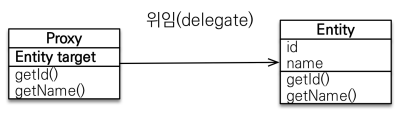

## 프록시
```java
// 조인쿼리가 기본적으로 발생한다.
// --> Team은 필요없는 경우라면 어떻게 해야할까
Member findMember = em.find(Member.class, member.getId());
System.out.println(findMember.getTeam().getName());
```
`Team의 정보는 필요하지 않는 경우라면 손해이다. 하지 않아도되는 조인을 했기때문에.`

## 프록시 기초
- em.find(): 데이터베이스를 통해서 실제 엔티티 객체 조회
- em.getReference(): 데이터베이스 조회를 미루는 가짜(프록시) 엔티티 객체 조회
```java
Member refMember = em.getReference(Member.class, member.getId());
System.out.println(refMember.getClass());
// class hello.jpa.proxy_lazyLoding.Member$HibernateProxy$x7UKM9TH --> 객체를 사용하기 전에는 쿼리가 발생하지 않는다.
```

### 프록시 특징
- 실제 엔티티 클래스를 상속 받아서 만들어진다.
- 실제 클래스와 겉모양이 같다.
- 이론상으로는 사용하는 입장에서는 진짜인지 프록시인지 구별할 필요는 없다.
- 프록시 객체는 실제 객체의 참조(target)을 보관하고 있다.


    
- 프록시 객체를 호출하면 프록시 객체는 실제 객체의 메소드를 호출한다.
- 프록시 객체는 한 번만 초기화된다.
- `프록시 객체가 초기화될 때, 실제 엔티티로 변경되는 것이 아니다. 실제 엔티티에 접근 할 수 있는 것일 뿐.`
- 준영속 상태에서는 프록시를 초기화 할 수 없다. (에러)

### 프록시 객체의 초기화
- 프록시객체가 target하는 객체가 없는경우 영속성 컨텍스트를 통해서 초기화를 진행한다.
- 초기화 요청을 받은 영속성 컨텍스트는 DB를 통해서 실제 값을 얻고 실제 엔티티를 생성한다.
- 이제 프록시객체에서 target객체로써 생성된 실제 엔티티를 통해서 값에 접근 할 수 있다.

### 지연로딩
`@ManyToOne(fetch = FetchType.LAZY)`
- 연관된 관계의 객체를 프록시를 통해서 실제 사용하는 시점에 DB를 통해서 가져온다.

### 즉시로딩
`@ManyToOne(fetch = FetchType.EAGER)`
- 연관된 관계의 객체를 함께 조회한다.(조인해서 한번에)

### 주의사항
- 가급적 지연로딩만 사용 할 것.
- JPQL에서 N+1 문제를 일으킨다.