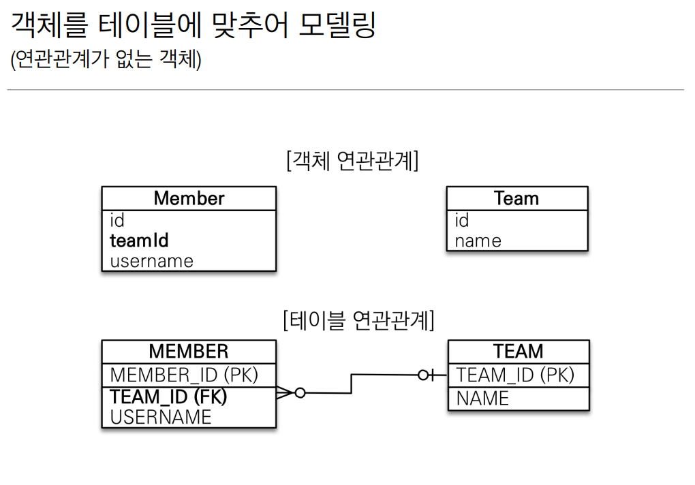
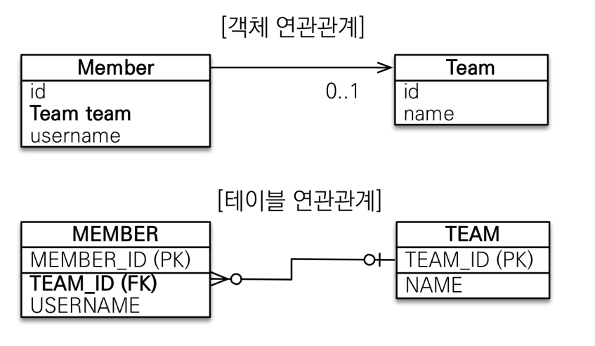
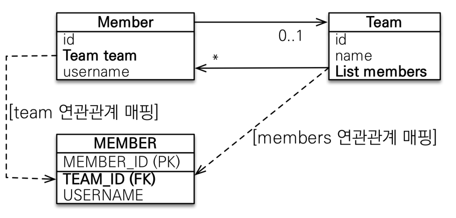

## 연관관계 매핑

**객체를 테이블에 맞추어 모델링**


- 회원 테이블과 팀 테이블은 N:1 관계이다.
    - 여러명의 회원은 하나의 팀에 소속 될 수 있다.
    
==> 외래키 식별자를 직접 다룬다.  
==> 각 엔티티간의 협력관계가 없다. 즉, 연관관계가 없는 상태.

---

**단방향 연관관계**

- 회원 테이블내에 기존의 teamId가 아닌 Team 객체를 통해서 연관관계를 설정한다.
- 실제 테이블 관계에서는 team_id를 외래키로하여 관계를 설정한다. (외래키)
- N의 입장인 엔티티에서 `@ManyToOne`하여 단방향 관계를 명시해준다.
  - `@JoinColumn`으로는 조인할 대상의 컬럼을 지정한다.
  - 연관관계의 fetch 방식중에 LAZY가 있다. (이 부부은 추후에 자세히)
  
==> 두 엔티티 사이에 참조를 통해서 데이터에 접근할 수 있다.  
==> 엔티티 참조를 통해서 등록/조회/수정 모두 가능하다.

---

**양방향 연관관계와 연관관계의 주인**
- 객체에서의 관계와 테이블에서의 관계의 패러다임 차이가 있다.

위의 예제에서 다시 생각해보자.
- `em.find(Member.class, memberId)`하여서 member 엔티티 내부에 있는 Team 객체를 통해서 데이터에 접근 할 수 있다.
  - 그러면 Team객체에서 회원에 대한 정보는? 어떻게 얻을 수 있을까?
  - `team.getMembers();` --> 불가능하다. 왜? member에서 team으로의 연관관계는 있지만, team에서 member로의 연관관계는 없다.
    - 단방향인 상태니깐!
  
그러면,,,
- 어떻게 해야 우리가 원하는 `team.getMembers()`를 할 수 있을까? --> 양방향 관계(매핑)을 설정해야 한다!

  
````
근데 문제가 한가지 있다.
Member에 있는 Team을 변경했을 때, 테이블의 FK가 업데이트 되어야 할까?  
아니면, Team에 members가 변경되었을 때, 테이블의 FK가 업데이트 되어야 할까?
어떤게 기준(주인)인가?  
-> 어떤것이 기준인지 정해주어야 한다. == 둘 중 하나로 외래키를 관리해야 한다. 
-> Member내의 Team으로 테이블의 FK를 관리 할 지,
Team내의 members로 테이블의 FK를 관리 할지 주인을 정해야한다.
````

연관관계의 주인(Owner)
- 객체의 두 관계 중 하나를 연관관계의 주인으로 지정한다.
- 연관관계의 주인만인 FK를 관리 할 수 있다. (등록/수정)
- 주인이 아닌쪽은 Read만 가능하다.
- 주인은 mappedBy 속성을 사용 할 수 없다.
- 주인이 아닌쪽에서 mappedBy 속성으로 주인이 누구인지 지정해준다.

- 누구를 주인으로 지정할까?
  - 외래키를 가지고 있는 엔티티를 주인으로 삼는다.

```java
@Entity
@Getter @Setter
@Table(name = "TEAM")
public class Team {
    @Id
    @Column(name = "TEAM_ID")
    @GeneratedValue(strategy = GenerationType.AUTO)
    private Long id;

    private String name;

    // team의 입장에서 하나의 팀은 여려명의 회원을 포함 할 수 있으니 OneToMany이다.
    @OneToMany(mappedBy = "team")
    private List<Member> members = new ArrayList<>();
}
```
- members는 Member.team에 의해서 관리가 되어진다라는 의미이다.
- 즉, Member와 Team 사이의 연관관계의 주인은 `Member.team`이다.


---

**양방향 매핑 주의 사항**
- 순수 객체 상태를 고려해서 항상 양쪽에 값을 설정하자.
  - 1차캐시로인해 데이터가 비어보일 수 있는 이슈
- 연관관계 편의 메소드를 생성해서 사용
- 양방향 매핑시 무한루프 주의
  - toString(), lonbok, JSON 생성 라이브러리
    - lombok에서 toString()을 사용하지 않는게 좋음. 쓰더라도 빼고서
    - 컨트롤러에서는 엔티티로 응답하지 말것.
      - 별도의 dto를 통해서?
  
---
**양방향 매핑 정리**
- 단방향 매핑만으로도 이미 연관관계 매핑은 완료가 된 것이다.
  - 테이블의 외래키에 대한 설계는 단방향만으로도 충분히 가능.
  - 일단 초기에는 단방향으로만 설계를 하자.
    - why? 일단 너무 복잡해질 수 있고, 양방향은 필요시에 추가해도 테이블에 영향이 없다.
  
- 양방향매핑은 반대반향으로 조회기능이 추가되는 것일 뿐이다.
  - ex) member, team 관계에서 team의 id로 회원목록을 조회
- JPQL에서 역방향으로 탐색할 일이 많다.
