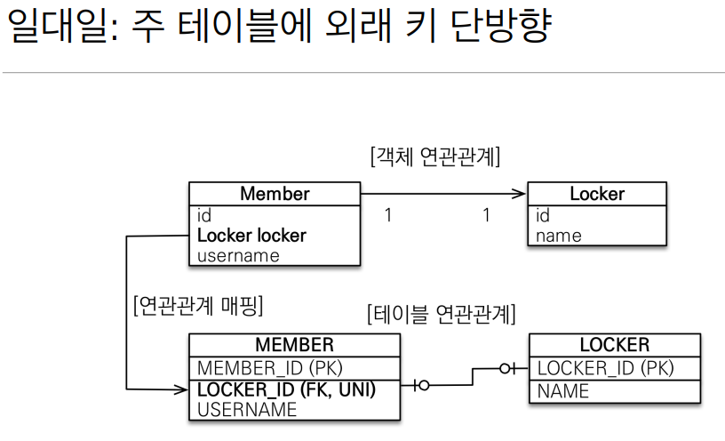
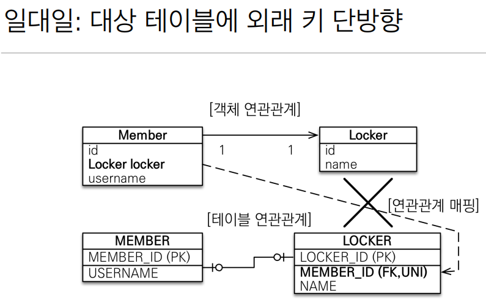

## 다양한 연관관계 매핑
- 다대일 N:1 -> @ManyToOne -> 가장 실무에서 많이 사용
- 일대다 1:N -> @OneToMany
- 일대일 1:1 -> @OneToOne
- 다대다 N:M -> @ManyToMany -> 실무에서 쓰지 않는다.

## 테이블과 객체의 패러다임 차이
- 테이블
    - 외래키하나로 양쪽 조인이 모두 가능하다. (= 단방향, 양방향 개념이 없다.)
- 객체
    - 참조용 필드가 있는 쪽으로만 참조가 가능하다.
    - 한쪽만 참조가 가능하면 단방향
    - 양쪽이 서로 참조가 가능하면 양방향
        - 객체의 입장으로 생각해보면 사실 각 객체가 단방향으로 연결되어 있는 것.
    

## 다대일
- N쪽에 외래키가 위치한다.
- 외래키가 있는 쪽이 관계의 주인이다.

## 일대다
- 다대일의 반대이다. 일(1)쪽이 관계의 주인이 된다.
- 테이블은 항상 다(N)쪽에 외래키가 있다.
- 객체와 테이블의 차이 때문에 반대편 테이블의 외래 키를 관리하는 특이한 구조

## 일대일
- 주 테이블이나 대상 테이블중에 외래키 선택 가능
- 외래키에 데이터베이스 유니크 제약조건 추가
- 다대일 연관매핑과 유사하다.

[주 테이블에 외래키가 있는 경우]

- 앞서의 다대일 방식과 똑같다.
```java
@OneToOne
@JoinColumn(name = "LOCKER_ID")
private Locker locker;
  ```
- (양방향) 주가 아닌 엔티티쪽에서 mappedBy를 통해서 매핑된 객체를 명시해주면 된다.
```java
// 일대일 양방향으로? -> 읽기전용
@OneToOne(mappedBy = "locker")  // Member 엔티티에 있는 locker를 의미
private Member member;
```
- 장점
    - 주 테이블만 조회해도 대상 테이블에 데이터가 있는지 확인 가능
- 단점
    - 값이 없으면 외래키에 null이 허용된다.


[대상 테이블에 외래키 단방향]

- 지원하지 않는다.
- 양방향 관계는 지원한다.
- 장점
    - 주 테이블과 대상 테이블을 일대일에서 일대다 관계로 변경할때 테이블 구조를 유지 할 수 있다.
- 단점
    - 지연로딩으로 설정해도 항상 즉시 로딩된다.
    

## 다대다
- 실무에서 사용하는 것을 비추한다.
    - 연결테이블이 자동으로 생성되지만 컬럼을 추가 할 방법이 없음
- 대안
    - 해당 관계를 엔티티로 승격해준다.
    - 그리고 @ManyToMany를 @OneToMany, @ManyToOne으로 풀어준다.