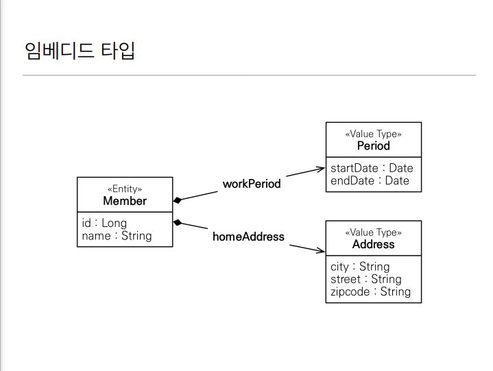
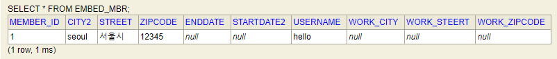

### 임베디드 타입
- 새로운 값 타입을 직접 정의할 수 있다.
- 주로 기본값 타입을 모아서 만들어서 복합 값 타입이라고도 한다.
- int, String과 같은 값 타입  

  
- 비슷한 특성을 가진 속성을 모아서 새롭게 구성한다는 것이다.
- class를 새롭게 뽑아서 정리해준다.

#### 장점
- 재사용
- 높은 응집도
- Period.isWork()처럼 해당 값 타입만 사용하는 의미있는 메소드를 만들수 있다.
- 임베디드 타입을 포함한 모든 값 타입은 값 타입을 소유한 엔티티의 생명주기에 의존한다.(같이 생성되고 같이 제거된다.)

#### 속성 재정의
- 임베디드 타입을 재사용할 때, 속성이 겹치는 경우 재정의 할 수 있다.
```java
@Embedded
@AttributeOverrides({
        @AttributeOverride(name="city",
                column=@Column(name="work_city")),
        @AttributeOverride(name="street",
                column=@Column(name="work_steert")),
        @AttributeOverride(name="zipcode",
                column=@Column(name="work_zipcode"))
})
private Address workAddress;
```
