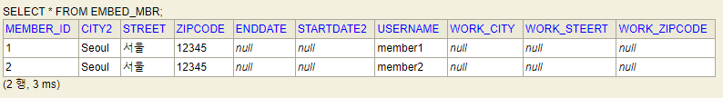
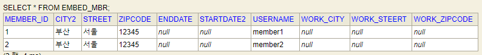

### 임베디드 타입
- 새로운 값 타입을 직접 정의할 수 있다.
- 주로 기본값 타입을 모아서 만들어서 복합 값 타입이라고도 한다.
- int, String과 같은 값 타입  

  
- 비슷한 특성을 가진 속성을 모아서 새롭게 구성한다는 것이다.
- class를 새롭게 뽑아서 정리해준다.

#### 장점
- 재사용
- 높은 응집도
- Period.isWork()처럼 해당 값 타입만 사용하는 의미있는 메소드를 만들수 있다.
- 임베디드 타입을 포함한 모든 값 타입은 값 타입을 소유한 엔티티의 생명주기에 의존한다.(같이 생성되고 같이 제거된다.)

#### 속성 재정의
- 임베디드 타입을 재사용할 때, 속성이 겹치는 경우 재정의 할 수 있다.
```java
@Embedded
@AttributeOverrides({
        @AttributeOverride(name="city",
                column=@Column(name="work_city")),
        @AttributeOverride(name="street",
                column=@Column(name="work_steert")),
        @AttributeOverride(name="zipcode",
                column=@Column(name="work_zipcode"))
})
private Address workAddress;
```


### 값 타입과 불변객체
- 임베디드와 같은 값 타입은 여러 엔티티에서 공유가 가능하다. 이를 공유하게되면 큰 장애로 이어질 수 있다.

```java
/* 값 타입 공유 이슈 */
Address address = new Address("Seoul", "서울", "12345");
Member member1 = new Member();
member1.setUsername("member1");
member1.setHomeAddress(address);
em.persist(member1);

Member member2 = new Member();
member2.setUsername("member2");
member2.setHomeAddress(address);
em.persist(member2);

Member findMember = em.find(Member.class, member1.getId());
findMember.getHomeAddress().setCity("부산");  // update query 발생 (dirty check)
tx.commit();
```

[처음상태]  


[commit 후]  
  

- 두 엔티티 모두 city 값이 변경되어다. -> `값 타입의 객체가 공유되면서 발생한 문제` ==> 이러면 망한다.

### 그렇다면 이러한 문제를 어떻게 대처해야 할까?
- 값(인스턴스)을 복사해서 사용해야한다.
    - 근데, 개발자가 실수로 참조값을 공유해버리는 경우는 막을 수 없다. (헉) -> 예방하는 수 밖에 없다. -> 불변객체로 구성한다. 

java primitive type은 `=`으로 값을 할당하면 값이 복사되어서 할당된다.
-> 즉, primitive type은 공유참조가 발생하지 않는다.

하지만, 객체타입은 값의 복사가 아닌 참조값을 복사하기에 공유참조가 발생 할 수 있다.
- 이게 객체타입의 한계이다.


### 객체타입을 아예 수정이 불가능하도록 하자. => 불변객체
- 생성시점 이후에 값을 변경할 수 없다.
- 다시 필요하다? -> 다시 생성해서 사용해야한다.
- 생성자로만 값을 할당 할 수 있다. setter도 만들지 않는다.


### 값타입의 비교
- 인스턴스가 달라도 그 안에 값이 동일하면 같은 것으로 봐야한다.
- 동일성 비교: 인스턴스의 참조값을 사용 (==)
- 동등성 비교: 인스턴스의 값을 비교(equals())
- equals()를 재정의하여 두 인스턴스를 비교해야 한다.